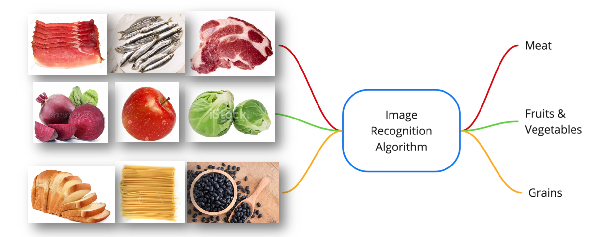
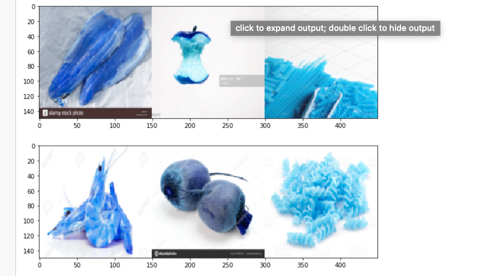
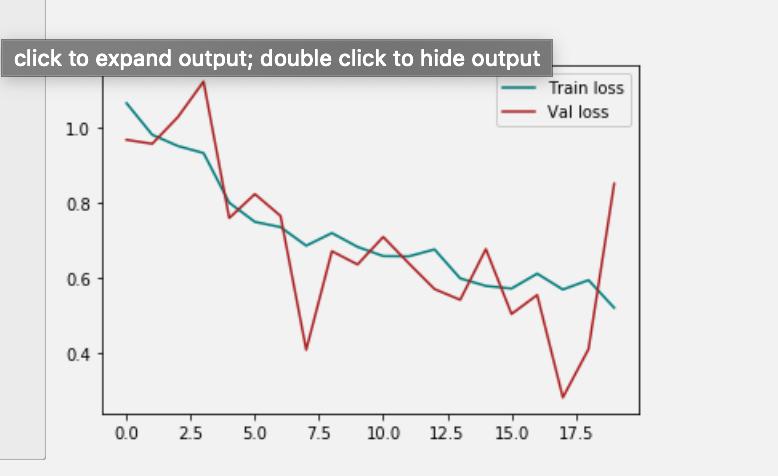
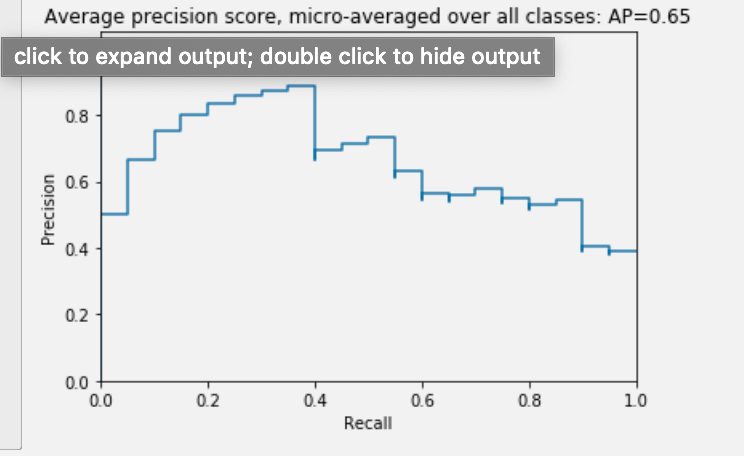

# Food-Ingredients-Recognition
   

## Introduction

Food recognition is an emerging topic in the field of computer vision and the interest in this area is justified by the rise in popularity of food diary applications.
I want to build a integrated system, which has the capability to recognise ingredients and recomend recipes based on the recognised items, for this reason, I have to build a very accurate image recognition algorithm, first.
Therefore, I tackle the problem of food ingredients recognition as a multi-class learning problem. I propose a method for adapting a highly performing state of the art Convolutional Neural Network architecture in order to act as a multi-class predictor for learning food ingredients in terms of their nature.
I plan to create a model that is able to give, given a picture, a prediction of its group of ingredients..

## Data Science Process

### Business Understanding

Cooking can be a hobby, a dreaded necessity or just a part of your routine, but no matter what your relationship with the kitchen is like, cooking takes time and effort. That’s where apps for iOS and Android step in, offering step-by-step instructions to help you prepare a hearty home-made meal or curate a weekly meal plan that goes with your diet.
The recipe app market is divided by three major segments, they are built-in recipe collection(meal planning), customizable do-it-yourself recipe collection apps(allows users to customize their own recipes) and social cooking(user can exchange their favorite recipes)
The key players in the market by Google Play Store users are Tasty (5 million), Cookpad (10 million), Allrecipes (5 million) and Yummly (5 million).

   
   
### Data Understanding

The models were trained and validated using a set of approximately 5,530 images of 63 food ingredients primarily obtained from a combination of sources, divided by 3 main groups Meat, Grains and Fruits/Vegetables.
These three groups represent the main part of the food pyramid and are essential for the most part of the recipes.
Using Google Imgage search, it was possible to obtain clear images of ingredients and because I needed a huge number of images, I had to use SerpWow, specialized website in web-scraping, for each image's url.

### Data Preparation

The urls of all images were converted in CSV files and grouped by ingredients. Using cv2, I was able to convert the CSV files in images ready to be used.
Because all the data set homogeneous, *i. e.* similiar to each other, I didnt have too much to explore. The only exception was the finding of class imbalance in the data.

### Modelling

In order to carry out the modelling, I split the final dataset into 3 subsets. Train (3587 images), Validation(471 images) and Test (544 images).
Baseline model consists of four convolution blocks with a max pool layer in each of them. There's a fully connected layer with 8 units on top of it that is activated by a relu activation function and three units activated by a softmax activation function.
For the second model, I take a new approach, because the baseline model shows a good performing, I want to see if it is possible with more agumentation arguments get even better results.
For the third model and I based my approach on the previous models results. This time, the model won't have augmentation, except the rescale, and use more epochs since the first model showed an increased performance over the time. Therefore, I want to see if it is possible to extrapolate the baseline model's accuracy with a bigger range of epochs.

 

## Evaluation

After analising the three models, the model that shows better performance is the baseline model, more stable, high accuracy and low overfitting.
To evaluate the winning model, I used Average precision because gives the average precision at all such possible thresholds and Precision-Recall metric. In this project, is an useful measure of success of prediction because the classes are imbalanced and I am not aiming any specific decision threshold.
Wiht an average precison of 0.65 and presicion-recall of class 'meat' = 0.83 / class 'fruits & vegetables' = 1 / class 'grains' = 0.25, I considered the created model good enough  to be integrated in a future recomendation system.

### Contact Info

For any queries or additional information, please email napd.65@gmail.com

###  Repository Navigation

   * Notebooks
   
     * Data Understanding / Modeling.ipynb

     * Webscrapping.ipynb

   * Data
     
     * Data_CSV

     * Ingredients
       
       * Fruits & Vegetables
       * Grains
       * Meat

     * Split_Sets
       
       * train
       * test
       * validation

   
   * Presentation
   
     * presentation.pdf
   
   * README.md
   
   
### References

-  SerpWow: [here](https://serpwow.com/)
-  Google Images: [here](https://www.google.com/imghp?hl=en)
-  Multi-Class Classification Tutorial with the Keras Deep Learning Library: [here](https://machinelearningmastery.com/multi-class-classification-tutorial-keras-deep-learning-library/)
-  Food Ingredients Recognition Through Multi-label Learning: [here](https://link.springer.com/chapter/10.1007/978-3-319-70742-6_37)
-  Mobile Food Recognition with an Extreme Deep Tree:[here](https://dl.acm.org/doi/10.1145/2967413.2967428)
-  Food Pyramid: [here](https://www.safefood.eu/Healthy-Eating/The-Food-Pyramid-and-The-Eatwell-Guide/The-Food-Pyramid.aspx)
-  Google Play Store: [here](https://play.google.com/store?hl=en)

### Image Disclaimer

All pictures copyright to their respective owner(s). I do not claim ownership of any of the pictures displayed on this project unless stated otherwise. I do not knowingly intend or attempt to offend or violate any copyright or intellectual property rights of any entity. Some images used on this project are taken from the web and believed to be in the public domain.